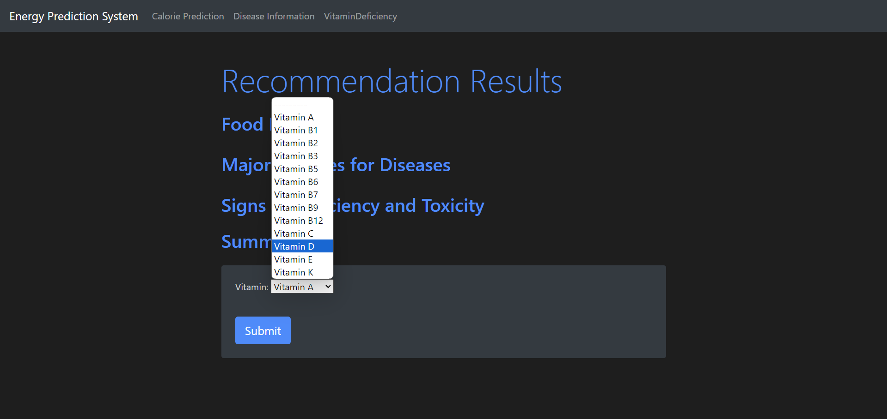

# NutrIAI

## Project Overview
NutrIAI is a comprehensive platform designed to analyze food composition and provide personalized nutrition recommendations based on individual needs. The project integrates machine learning models, data analytics, and an interactive web application to offer dietary suggestions, vitamin deficiency alerts, and disease-specific food recommendations.

## Key Features
1. **Calorie Prediction:** Predicts calorie intake based on nutrient input to assist users in managing their dietary goals.
2. **Vitamin Deficiency Recommendations:** Identifies potential vitamin deficiencies and suggests foods to address these gaps.
3. **Disease-Specific Food Recommendations:** Provides tailored food suggestions for various health conditions, helping users make informed dietary choices.
4. **Food Composition Information:** Retrieves detailed nutrient information based on vitamin inputs, aiding users in understanding their food better.

## Technologies Used
- **Backend:** Django (Python)
- **Frontend:** HTML, CSS, JavaScript
- **Data Analysis:** Pandas, NumPy, Matplotlib
- **Machine Learning:** Scikit-Learn, TensorFlow
- **Deployment:** Docker for containerization, Google Colab for model training

## Data Sources
NutrIAI utilizes various publicly available datasets on food composition, nutrient values, and dietary guidelines to create accurate and reliable recommendations.

## Model Architecture
- **Calorie Prediction Model:** Uses regression algorithms to predict calorie values based on input food items and their respective nutrient content.
- **Deficiency Analysis:** Classification models identify potential deficiencies based on user inputs and provide food suggestions to compensate for missing nutrients.
- **Recommendation System:** A rule-based and ML-driven approach to suggest foods tailored to specific dietary needs and health conditions.

## Approach

1. **Data Collection and Preprocessing:**
   - Aggregated data from multiple food databases.
   - Cleaned and standardized data using Pandas to ensure consistency and accuracy.
  
2. **Model Training:**
   - Built models for predicting caloric intake and identifying nutrient deficiencies using Scikit-Learn and TensorFlow.
   - Fine-tuned hyperparameters to enhance model accuracy and performance.

3. **Web Application Development:**
   - Developed a user-friendly interface with Django to display recommendations and insights dynamically.
   - Implemented REST APIs to connect the backend models with the frontend for real-time data processing.

4. **Deployment:**
   - Containerized the application using Docker for easy deployment and scalability.
   - Hosted on Google Cloud Platform for high availability and accessibility.

## Visualizations and Insights

### Calorie Prediction

### Vitamin Deficiency Analysis

### Disease-Specific Recommendations

### Food Composition Information

## Achievements
- Developed a unique and interactive platform that combines data science with nutritional science to provide personalized dietary recommendations.
- Successfully integrated machine learning models to improve the accuracy of recommendations and provide real-time feedback.

## Future Enhancements
- **Integration with Wearables:** Plan to integrate with wearable devices for real-time monitoring of dietary intake and physical activity.
- **Enhanced User Interface:** Ongoing improvements to the UI for a more engaging user experience.
- **Expanded Food Database:** Continuously adding more food items and nutrient data to improve the breadth of recommendations.

## GitHub Repository
For the complete codebase, dataset references, and additional resources, visit the [GitHub Repository] https://github.com/Eswar021/Nutrition_Project.

## Contact
For more information or collaboration opportunities, please reach out to pp2549@srmist.edu.in.

Description of the Project:

This project has 3 Section
Section 1: Predicts Calories based on the Nutrients User inputs and recommends the food that have a similar number of nutrients and calories
Section 2: if the user inputs Vitamin, it gives all the required information and recommends  Food that are rich in particular vitamin, and major chances of Diseases, Signs of Vitamin Deficiency and gives the summary of the vitamin
section 3: If user enters a Disease, it tells why you get that disease, Food sources that help you cure your disease, Causes of the Disease, Signs and Toxicity of the Disease, Treatment of the Disease and people who effects most (children, adults, elders, men , women , Pregnant women)

Technologies used: 
Classification: Random Forest Classifier
Prediction: Linear Regression
Recommendation and Similarity: Cosine Similarity
Database : Web Scrapping (Beautiful soap)

to install the required packages run the below command line in terminal

1. create a virtual environment of python 3.12 
2. pip install -r requirements.txt
3. run the model.ipynb, after running the model.ipynb now the model will be stored in the required directory
4. now go to project directory and run the app "python manage.py runserver"

python version: python 3.12

libraries used

*Set-ExecutionPolicy -Scope Process -ExecutionPolicy Bypass* -- if facing trouble activating environment run this command in the termical of the current directory
-
Package         Version
--------------- -----------
Django          5.0.3
pandas          2.2.1
pip             24.0
scikit-learn    1.4.1.post1
scipy           1.12.0
bs4             0.0.2
transformers
SentencePiece
torch

*pip3 install torch torchvision torchaudio

